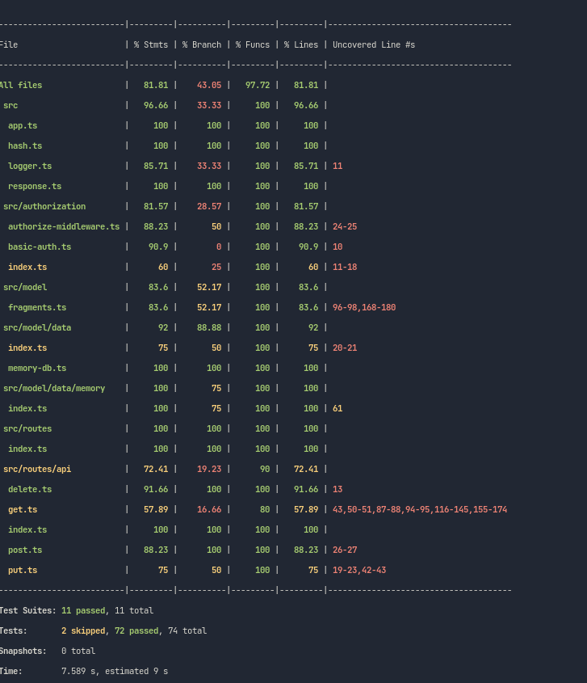

# Assignment 3 report

A short document listing all necessary resources in your system, specifically:

-  Links to both private GitHub repos

[Fragments](https://github.com/shawnyu5/fragments)

[Fragments ui](https://github.com/shawnyu5/fragments-ui)

-  Links to your public Docker Hub repos

[Fragments](https://hub.docker.com/repository/docker/shawnyu5/fragments)

[Fragments ui](https://hub.docker.com/repository/docker/shawnyu5/fragments-ui)

-  Link to successful GitHub Actions CI workflow run, showing eslint, unit tests, and Docker image publish to Docker Hub

[CI workflow](https://github.com/shawnyu5/fragments/runs/7910786302?check_suite_focus=true)

-  Screenshot of running npm run coverage to show that you've been able to properly cover the majority of your files and lines of code. Make sure your coverage rate is high enough to reflect proper testing for all units of code (>80% and includes all necessary files).

-  List of deficiencies: any known bugs, unsupported spec requirements, missing tests, or other issues that you did not, or could not complete. Discuss what still needs to be done in order to complete these.

Two of the things I did not complete is getting AWS elastic bean stock to work, and S3. Bean stock didn't accept my docker file for some reason. And I wasn't able to properly store data into S3.

[Demo presentation](https://youtu.be/vwCCceiPr4o)
