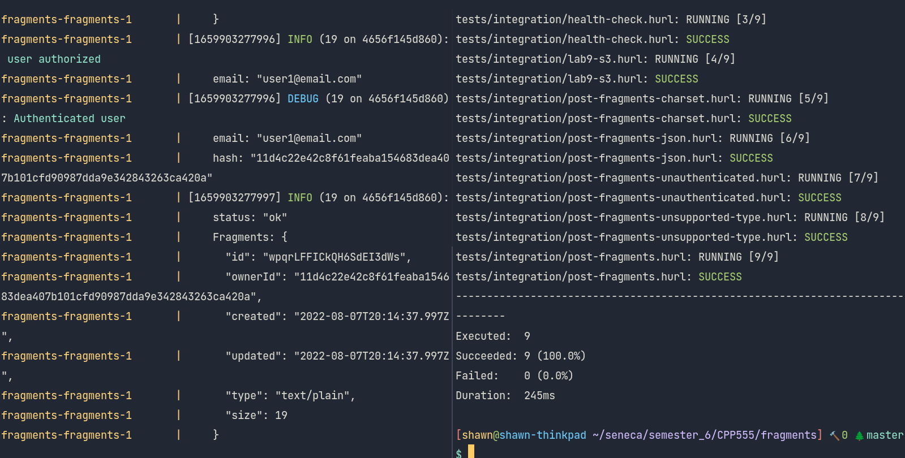
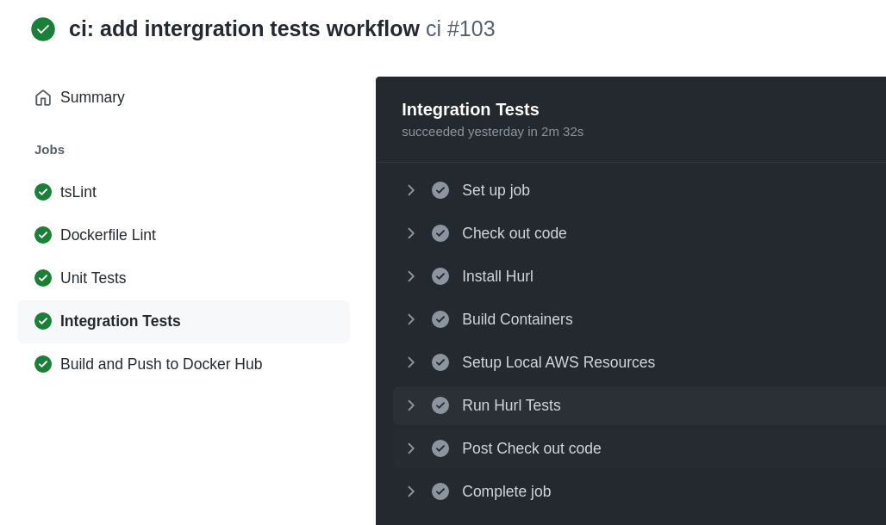
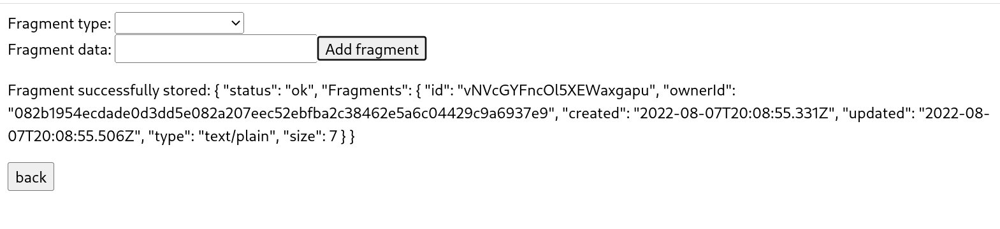
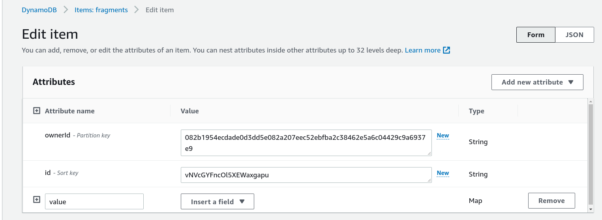

-  Link to your completed `tests/integration/lab-10-dynamodb.hurl` in your `fragments` GitHub repo

[lab-10-dynamodb.hurl](https://github.com/shawnyu5/fragments/blob/master/tests/integration/dynamodb.hurl)

-  Screenshot of your `tests/integration/lab-10-dynamodb.hurl` test passing, when run against your `fragments` server, `LocalStack`, and `DynamoDB Local` using `docker-compose` (i.e., show the terminal(s) running the necessary commands to make this happen).

-  Screenshot of your `ci.yml` GitHub Actions Workflow passing everything, including your **integration tests**.

-  Screenshot of your `fragments-ui` creating a fragment using your **Elastic Beanstalk** deployment (i.e., show the **Network** tab to prove which back-end service is being used)

-  Screenshot of the **AWS DynamoDB Console** showing the fragment you just created in DynamoDB as an **Item** in your **Table** (i.e., prove that you've been able to create the fragment metadata in DynamoDB)

