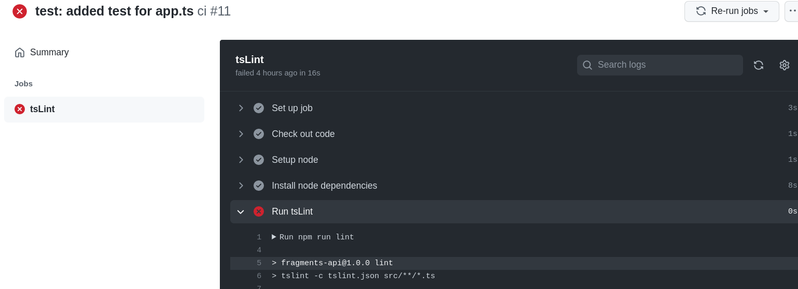
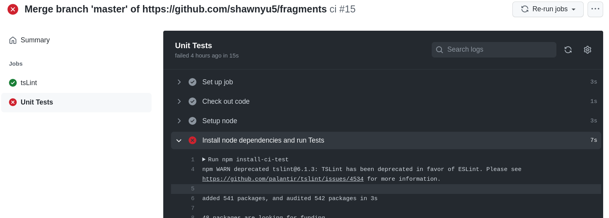
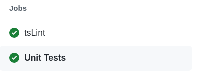
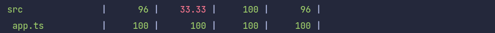

# Lab 3 submission

CI workflow failing ESLint

----------------------------------------------------

CI workflow failing one or more Unit Tests

----------------------------------------------------

CI workflow passing ESLint

)]

----------------------------------------------------

CI workflow passing all Unit Tests

)]

----------------------------------------------------

test coverage report, showing the app.js 404 handler being covered

----------------------------------------------------
