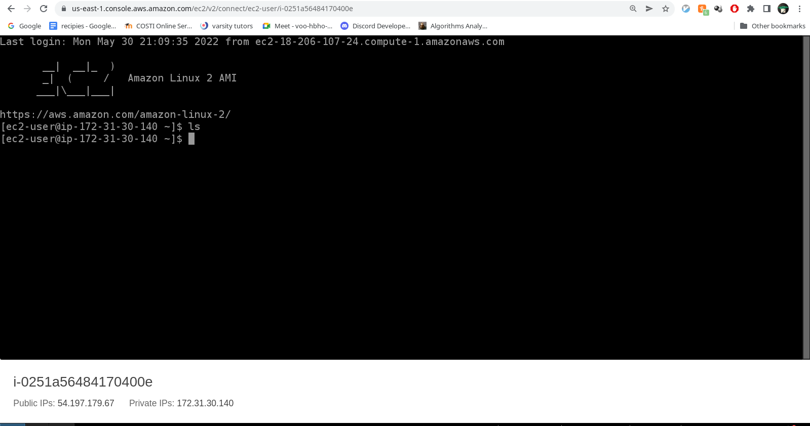
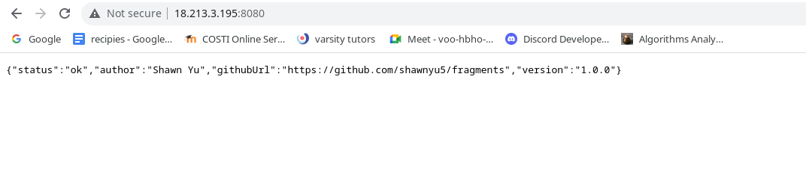
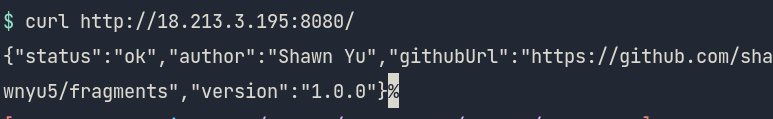
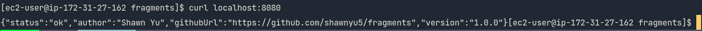
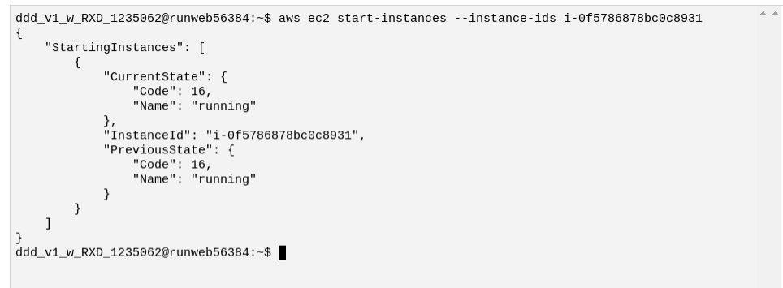
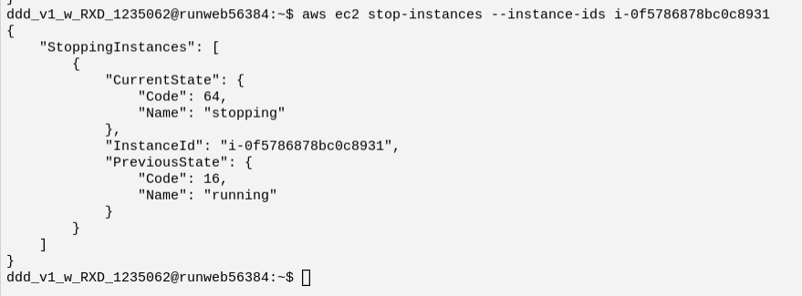

# Lab 4

[fragments repo](https://github.com/shawnyu5/fragments)

Screenshot of your running EC2 instance details in the AWS Console

Screenshot of accessing your microservice’s health check running on EC2 via the browser

Screenshot of accessing your microservice’s health check running on EC2 via curl in a terminal on your local computer

Screenshot of accessing your microservice’s health check running on EC2 via curl in a terminal on the EC2 instance accessed via localhost

Screenshot of starting your EC2 instance in the AWS CLI with output

Screenshot of stopping your EC2 instance in the AWS CLI with output

