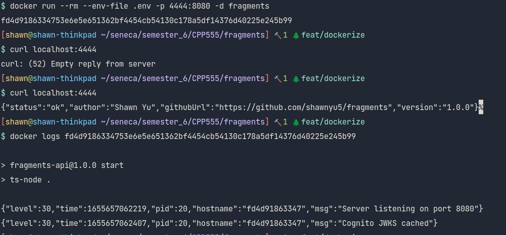

# Lab 5

1. Links to your fragments microservice’s Dockerfile and .dockerignore files on
   GitHub.

[Fragments](https://github.com/shawnyu5/fragments)

[Fragments ui](https://github.com/shawnyu5/fragments-ui)

2. Screenshots of your fragments microservice running as a Docker container in
   detached mode. Use port 4444 on your host and port 8080 in the container.
   Use curl or your browser to hit the server’s health check route inside the
   container, and docker logs to show the server’s logs when you do.

3. Screenshot of your fragments microservice container running in Visual Studio
   Code via the Docker Extension. Right-click it and include the logs.

4. Screenshots of your fragments microservice running as a Docker container in
   detached mode on EC2. Use port 8080 on your EC2 host and port 8080 in the
   container. Use curl or your browser to hit the EC2 server’s health check
   route inside the container, and docker logs on the EC2 instance to show the
   server’s logs when you do.

