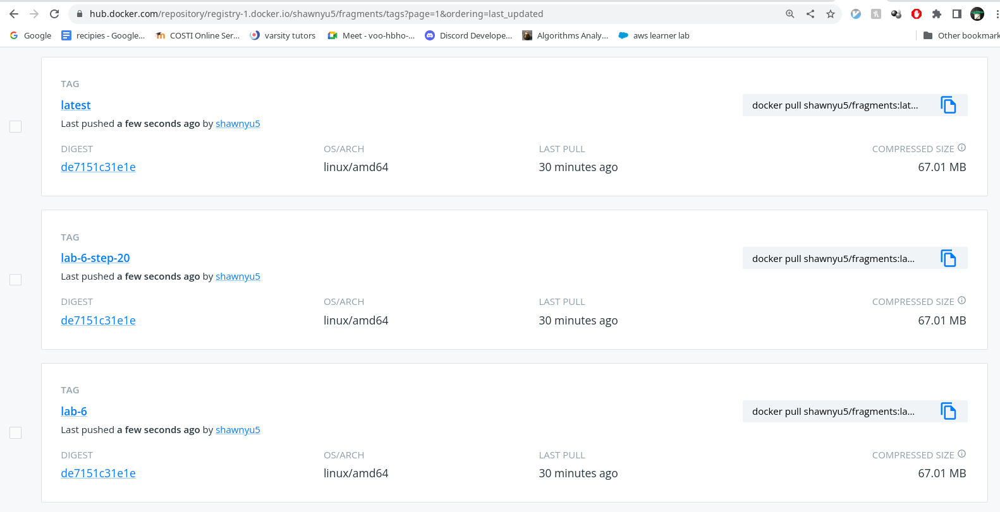
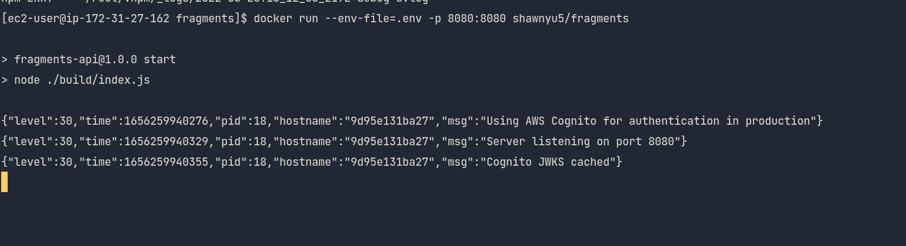

# lab 6

1. Link to your updated `fragments` microservice `Dockerfile` on GitHub, showing your optimizations from step 20 above.

[Docker file](https://github.com/shawnyu5/fragments/blob/master/Dockerfile)

2. Link to your [Docker Hub](https://hub.docker.com/) `fragments` repository

[Docker hub](https://hub.docker.com/r/shawnyu5/fragments)

3. Screenshot of all of the expected Docker **Tags** in your [Docker Hub](https://hub.docker.com/) repository (see the **Tags** tab)

4. Screenshot of an EC2 instance running your `fragments` [Docker Hub](https://hub.docker.com/) image.

5. Explanation of the optimizations and requirement you implemented in steps 20
   and 21. Include screenshots, text, code, or whatever you need in order to
   prove that it's been done.

In step 20, I converted the [docker
file](https://github.com/shawnyu5/fragments/blob/master/Dockerfile) to have a
multi stage build. In the first container using a full node environment, to
compile typescript into JavaScript. Then the second container copies over the
just build JavaScript, excluding the typescript, and installs node modules
again.

And for assignment 2, I implemented the `/fragments/?expanded` [route with unit
tests](https://github.com/shawnyu5/fragments/commit/a9c3a0026f9401eca14c8636b10bba173367746c),
so without the expand flag, the route will return an array of fragment id. With
the flag, the route will return an array of fragment objects.
