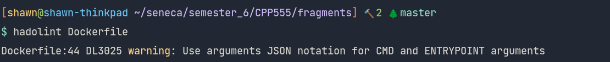
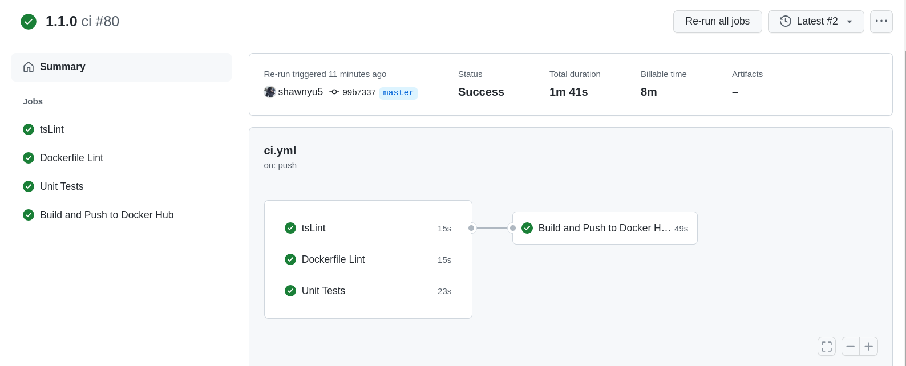
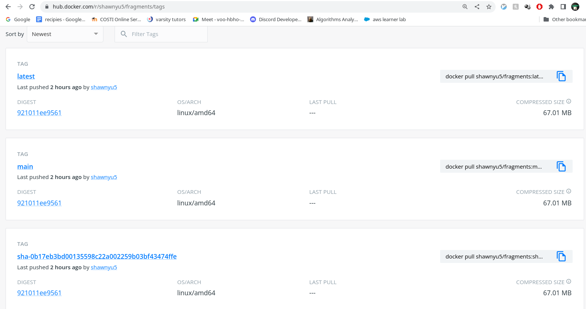
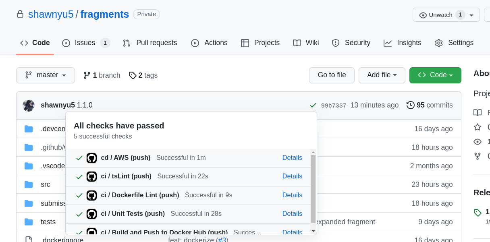
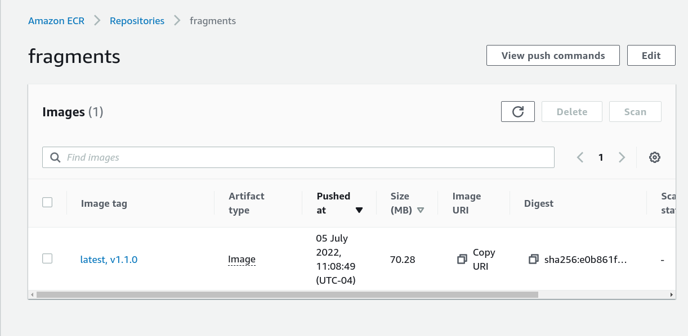
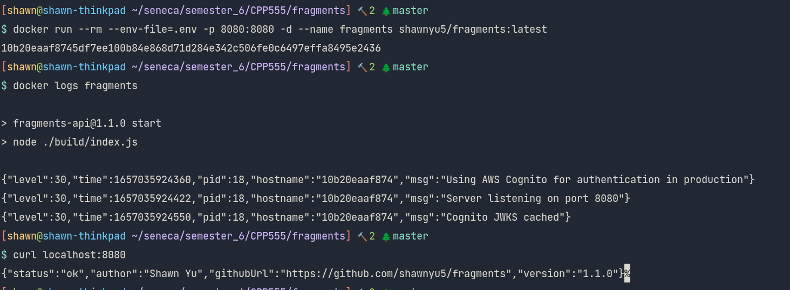
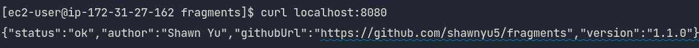

# Lab 7

1. Screenshot of the first time you ran Hadolint on your Dockerfile, showing any
   warnings or errors you had to correct.

2. Screenshot of a successful CI workflow, showing your new Dockerfile Lint and
   Docker Hub jobs succeeding.

3. Screenshot of your main and latest Tags in Docker Hub, created by your GitHub
   Actions ci.yml workflow.

4. Screenshot of a successful CD workflow, showing your AWS login, build and
   push jobs succeeding.

5. Screenshot of your Amazon Elastic Container Registry showing your fragments
   Image and tags, built via GitHub Actions.

6. Screenshot of of your local machine running the main image from Docker Hub,
   built and pushed by your GitHub Actions ci.yml workflow.

7. Screenshot of of EC2 instance running the v0.7.0 image (or your latest
   version tag) your Amazon Elastic Container Registry and fragments repo, built
   and pushed by your GitHub Actions cd.yml workflow.

