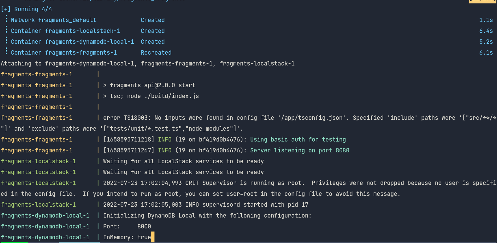
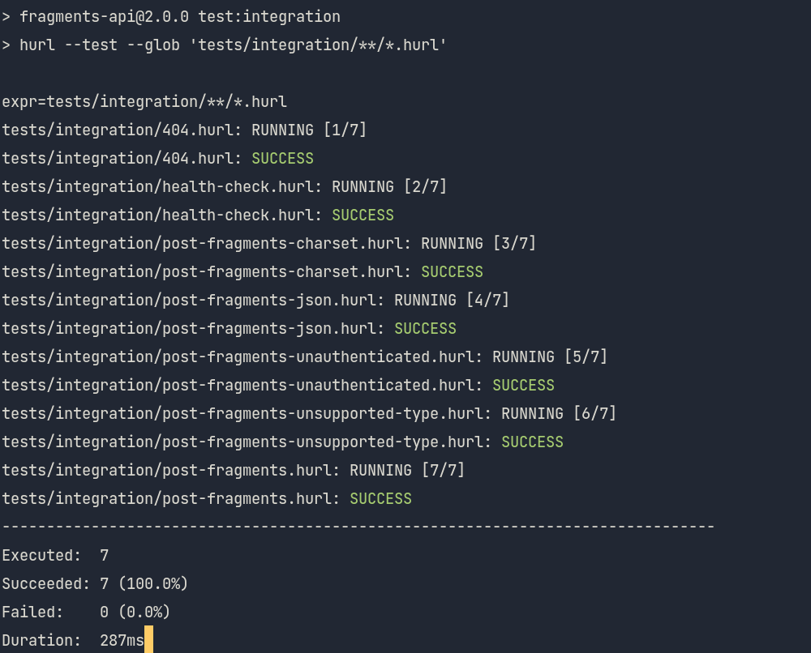

# Lab 8

1. Add all of the changes you've made to your code to git and `push` to GitHub.
   Link to the `tests/integration` folder on GitHub for your `fragments` repo,
   showing all of the `.hurl` files you wrote for the test cases above.

[Hurl tests](https://github.com/shawnyu5/fragments/tree/master/tests/integration)

2. Screenshot of all three containers successfully being started using
   `docker-compose`.

3. Screenshot of the `local-aws-setup.sh` running successfully against the
   running containers

4. Screenshot of hurl successfully running all of the integration tests
   described above.

