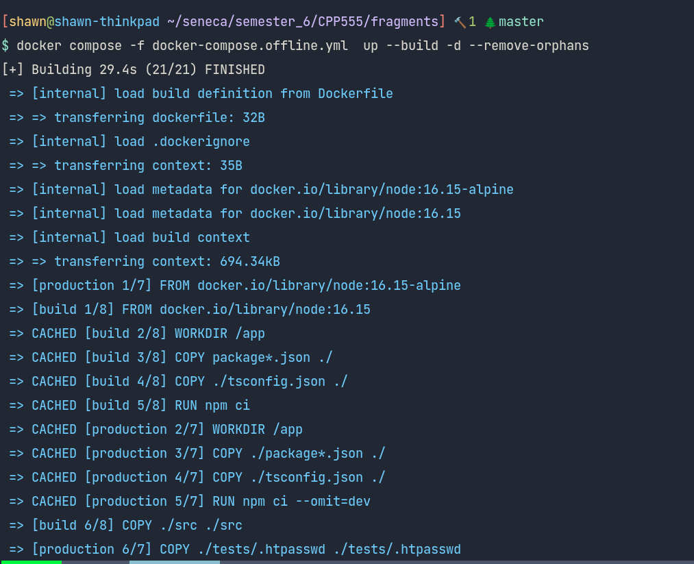
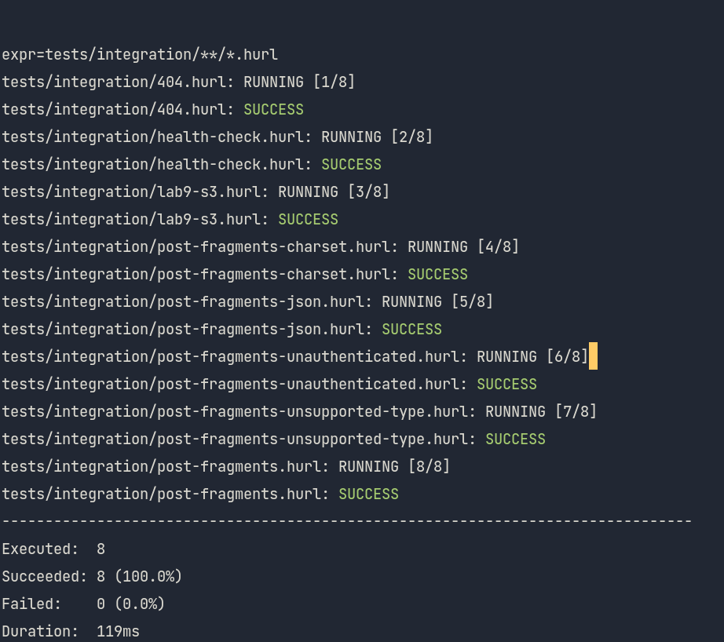

# Lab 9

-  Link to your completed `tests/integration/lab-9-s3.hurl` in your `fragments` GitHub repo

[lab9-s3.hurl](https://github.com/shawnyu5/fragments/blob/master/tests/integration/lab9-s3.hurl)

-  Screenshot of your `tests/integration/lab-9-s3.hurl` test passing, when run against your `fragments` server and `LocalStack` using `docker-compose` (i.e., show the terminal(s) running the necessary commands to make this happen)

